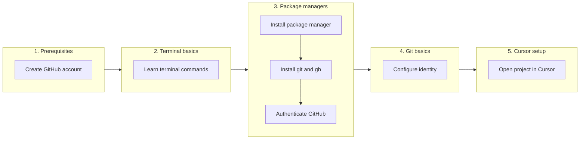

# Setup fundamentals

## Table of Contents

- [0. Overview](#0-overview)
- [1. Prerequisites](#1-prerequisites)
- [2. Terminal basics](#2-terminal-basics)
- [3. Package managers](#3-package-managers)
- [4. Git basics](#4-git-basics)
- [5. Cursor setup](#5-cursor-setup)
- [6. Troubleshooting](#6-troubleshooting)
- [7. Reference](#7-reference)

---

## 0. Overview



---

## 1. Prerequisites

1. Create a [GitHub account][github-signup] if you don't have one
2. Enable two-factor authentication (2FA) in account settings

> [!NOTE]
> 2FA is required for contributors and recommended for everyone.

---

## 2. Terminal basics

The **terminal** is an application for executing text commands instead of using a graphical interface. The **shell** is the program that interprets your commands (bash, zsh, etc.). On macOS, use the built-in **Terminal** app. On Windows, use **Git Bash** (installed with Git).

**Commands:**

| Command       | Description                    |
| ------------- | ------------------------------- |
| `pwd`         | Print current directory path    |
| `ls`          | List files in current directory |
| `cd folder`   | Change to specified directory   |
| `cd ..`       | Move up one directory level     |
| `cd ~`        | Change to home directory        |
| `mkdir folder`| Create a new directory          |
| `cat file`    | Display file contents           |

**Keyboard shortcuts:**

| Key    | Action                  |
| ------ | ----------------------- |
| Tab    | Cycle through options   |
| Right  | Autocomplete suggestion |
| Up     | Previous command        |
| Ctrl+C | Cancel current command  |

---

## 3. Package managers

A **package manager** is a tool that installs and updates software from the command line. Instead of downloading installers from websites, you run a single command.

1. Install a package manager:
   - **macOS:** [Homebrew][brew]
   - **Windows:** [Scoop][scoop]
2. Restart your terminal
3. Install tools:

| macOS                 | Windows                |
| --------------------- | ---------------------- |
| `brew install git gh` | `scoop install git gh` |

> [!NOTE]
> **Windows:** Use **Git Bash** for terminal commands (installed with Git). WSL works too but adds complexity.

### Authenticate GitHub CLI

After installing `gh`, run:

```bash
gh auth login
```

Follow the prompts. This handles GitHub authentication automatically.

**Docs:** [GitHub CLI][gh-cli]

---

## 4. Git basics

**Git** is version control software that tracks changes to your code. It allows you to create commits (saved states), revert to previous versions, upload to hosting platforms like GitHub, and merge work from multiple branches.

### Key concepts

| Term                  | Meaning                                                              |
| --------------------- | -------------------------------------------------------------------- |
| **Repository**        | A folder tracked by Git that contains your project and its history   |
| **Working directory** | Current state of files in your repository                            |
| **Unstaged changes**  | Modified files not yet selected for commit                           |
| **Staged changes**    | Changes selected to include in the next commit                       |
| **Commit**            | A saved snapshot of staged changes                                   |

> [!NOTE]
> Git stores all version history and metadata in a hidden `.git/` folder inside your repository. You never need to edit this folder directly.

Staging allows you to commit specific changes while leaving others uncommitted. Use `git add <file>` to stage individual files, or `git add .` to stage everything.

### First time setup

Run these once to configure your identity:

```bash
git config --global user.name "Your Name"
git config --global user.email "your@email.com"
```

### Essential commands

| Command                     | Description                        |
| --------------------------- | ----------------------------------- |
| `git init`                  | Initialize a new repository         |
| `git clone <url>`           | Download an existing repository     |
| `git status`                | Show modified files                 |
| `git add .`                 | Stage all changes for commit        |
| `git commit -m "msg"`       | Save staged changes with a message  |
| `git push`                  | Upload commits to remote repository |
| `git log --oneline`         | List commit history                 |
| `git log --oneline --graph` | List commit history as a tree       |

> [!TIP]
> Commit after each completed change. This makes it easier to revert if needed.

### Undo commands

**Discard uncommitted changes:**

> [!WARNING]
> These commands permanently delete uncommitted changes. Commit your work first if you want to keep it.

| Command            | Description                                          |
| ------------------ | ----------------------------------------------------- |
| `git restore .`    | Discard unstaged changes only (keeps staged changes)  |
| `git reset --hard` | Discard all changes (both staged and unstaged)        |

**Undo commits:**

> [!WARNING]
> Recovery via `git reflog` is sometimes possible if the commit hasn't been garbage collected, but this isn't guaranteed. Use with caution.

| Command                   | Description                           |
| ------------------------- | -------------------------------------- |
| `git reset --soft HEAD~1` | Undo last commit, keep changes staged  |
| `git reset --hard HEAD~1` | Undo last commit, discard changes      |

### Optional: Git GUI

Cursor has built-in git features (Timeline panel, Source Control tab), but a dedicated Git GUI makes it easier to browse many commits at once in a larger view.

| App                      | Install                          | Notes                           |
| ------------------------ | -------------------------------- | ------------------------------- |
| [Sourcetree][sourcetree] | `brew install --cask sourcetree` | Free, polished. macOS + Windows |

**Docs:** [Git][git-docs]

---

## 5. Cursor setup

### Project structure

```
your-project/
├── .cursor/
│   └── rules/
│       └── project.md    # Your project rules
├── .cursorignore         # Files agent should ignore
└── ...
```

### Sample .cursorignore

```
node_modules/
dist/
build/
```

### Install CLI command

1. Open command palette: `Cmd+Shift+P` (macOS) or `Ctrl+Shift+P` (Windows)
2. Search: "Shell Command: Install 'cursor' command in PATH"
3. Open any folder from terminal:
   ```bash
   cursor .
   ```

**Docs:** [Cursor Rules][cursor-rules]

### Enable autosave

Add this to your User Settings JSON (`Cmd+Shift+P` > "Preferences: Open User Settings (JSON)"):

```json
"files.autoSave": "afterDelay",
"files.autoSaveDelay": 1000
```

This removes the need to manually save. Changes appear in `git status` automatically.

### Chat modes

- **Agent** (`Cmd+I` / `Ctrl+I`) - Plan, search, build anything
- **Plan** (`Cmd+P` / `Ctrl+P`) - Create detailed plans for accomplishing tasks
- **Ask** - Ask Cursor questions about your codebase

#### Context symbols

Use `@` symbols in prompts to give the agent more context:

- `@files` - browse files or folders
- `@<filename>` - include specific file/folder
- `@docs` - include external documentation
- `@git` - reference git changes and diffs
- `@browser` - open an embedded browser tab
- `@terminals` - browse terminal windows

> [!TIP]
> You can also attach images by clicking the image button or pasting directly into chat.

### Auto-run modes

Go to **Settings > Features > Agent** and configure:

| Setting           | Options                                               | Recommended            |
| ----------------- | ----------------------------------------------------- | ---------------------- |
| Command execution | Ask Every Time / Auto-Run in Sandbox / Run Everything | **Ask Every Time**     |

- **Ask Every Time** - You approve each command before it runs (safest)
- **Auto-Run in Sandbox** - Commands run automatically in a sandbox if possible with restricted network and filesystem access. Otherwise fallback to allowlist.
- **Run Everything (Unsandboxed)** - All commands run automatically without prompts

> [!NOTE]
> The sandbox allows reads and writes within your workspace but blocks network access and git operations by default. You'll still be asked to approve operations that need additional permissions.

### Keyboard shortcuts

| Action                   | macOS       | Windows     |
| ------------------------ | ----------- | ----------- |
| Toggle left sidebar      | `Cmd+B`     | `Ctrl+B`    |
| Open Agent mode          | `Cmd+I`     | `Ctrl+I`    |
| Open Plan mode           | `Cmd+P`     | `Ctrl+P`    |
| Switch modes             | `Cmd+.`     | `Ctrl+.`    |
| Toggle Agent/Editor view | `Cmd+E`     | `Ctrl+E`    |

---

## 6. Troubleshooting

| Problem                     | Solution                                             |
| --------------------------- | ---------------------------------------------------- |
| Cursor features not working | Try running `git init`, then close and reopen folder |
| GitHub authentication fails | Try re-running `gh auth login`                       |
| Agent can't see my files    | Verify `.cursorignore` is not excluding them         |
| New packages not working    | Run `npm install` manually after adding dependencies |

---

## 7. Reference

### Tools
- [Homebrew][brew] (macOS package manager)
- [Scoop][scoop] (Windows package manager)
- [Sourcetree][sourcetree] (Git GUI)

### Documentation
- [Git][git-docs] - Version control
- [GitHub][github-docs] - Platform documentation
- [GitHub CLI][gh-cli] - Command-line interface
- [Cursor][cursor-docs] - Editor documentation
- [Cursor Rules][cursor-rules] - Project context rules

<!-- Link definitions -->
[github-signup]: https://github.com/signup
[brew]: https://brew.sh
[scoop]: https://scoop.sh
[gh-cli]: https://cli.github.com/manual
[sourcetree]: https://sourcetreeapp.com
[git-docs]: https://git-scm.com/doc
[github-docs]: https://docs.github.com
[cursor-docs]: https://cursor.com/docs
[cursor-rules]: https://cursor.com/docs/context/rules