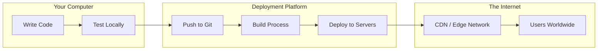

# Deployment guide

## Table of Contents

- [0. Overview](#0-overview)
- [1. Prerequisites](#1-prerequisites)
- [2. Vercel deployment](#2-vercel-deployment)
- [3. Environment variables](#3-environment-variables)
- [4. Other platforms](#4-other-platforms)
- [5. Security basics](#5-security-basics)
- [6. Troubleshooting](#6-troubleshooting)
- [7. Reference](#7-reference)

---

## 0. Overview

Deployment makes your code accessible on the internet via a URL.



### Key terms

| Term                      | Meaning                                               |
| ------------------------- | ----------------------------------------------------- |
| **Build**                 | Converting code into optimized files for production   |
| **CDN**                   | Servers worldwide that serve your site fast           |
| **Production**            | The live version users see                            |
| **Preview**               | A test version to check before going live             |
| **Environment Variables** | Secret configuration values (API keys, database URLs) |

---

## 1. Prerequisites

1. Complete [Setup fundamentals][setup-fundamentals]
2. Install Node.js:
   - **macOS:** `brew install node`
   - **Windows:** `scoop install node`
3. Create a [Vercel][vercel] account (sign up with GitHub)

> [!TIP]
> For managing multiple Node.js versions, install [n][n-version-manager] (macOS/Linux) or [nvm-windows][nvm-windows]. This lets you switch between versions easily.

---

## 2. Vercel deployment

**Vercel** is a deployment platform optimized for frontend frameworks and static sites. It connects to your Git repository and automatically deploys your code whenever you push changes.

**Why Vercel?**

- Zero configuration for most frameworks
- Automatic HTTPS
- Global CDN (fast everywhere)
- Free tier: 100 GB bandwidth/month
- Every PR gets its own preview URL

### Connect repository

1. Go to [vercel.com][vercel], click "Add New..." then "Project"
2. Select your GitHub repository
3. Vercel auto-detects your framework
4. Click "Deploy"

You get a URL like: `https://your-project.vercel.app`

> [!NOTE]
> Vercel automatically provides a unique preview URL for every branch and pull request. This makes it easy to test changes before merging to production.

### Automatic deployments

| Action               | Result                                    |
| -------------------- | ----------------------------------------- |
| Push to `main`       | Production deployment (live site updates) |
| Push to other branch | Preview deployment (unique test URL)      |
| Open Pull Request    | Preview URL added as comment              |

> [!TIP]
> Use preview deployments to test changes before merging. Share the preview URL with teammates or clients for feedback.

**Docs:** [Vercel][vercel-docs]

---

## 3. Environment variables

**Environment variables** are configuration values stored outside your code. They hold sensitive data like API keys, database URLs, and secrets. Never commit them to Git.

### Via Dashboard

1. Go to Project > Settings > Environment Variables
2. Add name + value
3. Select environment (Production, Preview, Development)

### Via CLI

```bash
npm i -g vercel          # Install CLI
vercel login             # Authenticate
vercel env add KEY_NAME  # Add variable (prompts for value)
vercel env pull          # Pull vars to local .env
```

> [!TIP]
> Use `vercel dev` to run a local development server that mimics the production environment, including environment variables.

### Environment scopes

| Scope           | When it's used                       |
| --------------- | ------------------------------------ |
| **Production**  | Live deployments on your main domain |
| **Preview**     | PR and branch preview deployments    |
| **Development** | When running `vercel dev` locally    |

> [!NOTE]
> Local `.env` files are not automatically used by Vercel deployments. You must set environment variables through the dashboard or CLI for them to be available in production.

**Next.js note:** Client-side variables must be prefixed with `NEXT_PUBLIC_`

```
NEXT_PUBLIC_API_URL=https://api.example.com  # Accessible in browser
DATABASE_URL=postgres://...                   # Server-side only
```

**Docs:** [Vercel CLI][vercel-cli]

---

## 4. Other platforms

While Vercel is excellent for frontend projects, different platforms serve different needs. Here's a comparison of popular deployment options:

| Platform    | Best for              | Free tier        | Deploy command            |
| ----------- | --------------------- | ---------------- | ------------------------- |
| **Vercel**  | Next.js, React        | 100 GB bandwidth | `vercel --prod`           |
| **Netlify** | Static sites, forms   | 300 credits/mo   | `netlify deploy --prod`   |
| **Railway** | Full-stack + database | $5 credit/mo     | `railway deploy`          |
| **Render**  | Heroku replacement    | 750 hours/mo     | Git push or `render.yaml` |
| **Replit**  | Browser-based dev     | 10 GiB egress    | Click "Deploy"            |

**Quick recommendations:**

| Situation                   | Use               |
| --------------------------- | ----------------- |
| First deployment / learning | Vercel or Replit  |
| Next.js app                 | Vercel            |
| Need a database             | Railway or Render |
| No local setup              | Replit            |

---

## 5. Security basics

Deployed applications are publicly accessible, making security essential. The most common mistake is accidentally exposing API keys, database credentials, or other secrets in your code.

> [!WARNING]
> Never commit secrets or API keys to Git. Once pushed, they are visible in your repository's history even if you delete them later. Always use environment variables.

**Always add to `.gitignore`:**

```gitignore
.env
.env.local
.env.production
.env*.local
.vercel
node_modules
```

**Checklist before production:**

- [ ] All secrets in platform's dashboard (not in code)
- [ ] `.env` files in `.gitignore`
- [ ] No hardcoded API keys in source
- [ ] HTTPS enabled (automatic on Vercel/Netlify)

---

## 6. Troubleshooting

| Problem                          | Solution                                                 |
| -------------------------------- | -------------------------------------------------------- |
| `Module not found`               | Run `npm install package-name`, commit `package.json`    |
| Works locally, fails deployed    | Check env vars are set in Vercel dashboard               |
| 404 on page refresh (React/Vite) | Add `vercel.json` with rewrites (see below)              |
| Node version mismatch            | Add `"engines": { "node": "18.x" }` to `package.json`    |
| Build fails                      | Check logs in Vercel dashboard under deployment > "Logs" |

**Fix for React/Vite 404s:**

```json
{
  "rewrites": [{ "source": "/(.*)", "destination": "/" }]
}
```

---

## 7. Reference

### Platforms
- [Vercel][vercel] - Frontend deployment platform
- [Netlify][netlify] - Static site hosting
- [Railway][railway] - Full-stack deployment with databases
- [Render][render] - Application hosting
- [Replit][replit] - Browser-based development and deployment

### Documentation
- [Vercel Docs][vercel-docs] - Platform documentation
- [Vercel CLI][vercel-cli] - Command-line deployment tool
- [Next.js Deployment][nextjs-deployment] - Framework-specific guides
- [Netlify Docs][netlify-docs] - Platform documentation
- [Railway Docs][railway-docs] - Platform documentation
- [Render Docs][render-docs] - Platform documentation
- [Node.js][nodejs] - JavaScript runtime

### Commands

| Command               | Description            |
| --------------------- | ---------------------- |
| `npm i -g vercel`     | Install Vercel CLI     |
| `vercel login`        | Authenticate           |
| `vercel`              | Deploy to preview      |
| `vercel --prod`       | Deploy to production   |
| `vercel env pull`     | Pull env vars to local |
| `vercel env add NAME` | Add env variable       |
| `vercel dev`          | Run local dev server   |

<!-- Link definitions -->
[setup-fundamentals]: 1-setup-fundamentals.md
[vercel]: https://vercel.com
[netlify]: https://netlify.com
[railway]: https://railway.app
[render]: https://render.com
[replit]: https://replit.com
[nodejs]: https://nodejs.org
[n-version-manager]: https://github.com/tj/n
[nvm-windows]: https://github.com/coreybutler/nvm-windows
[vercel-docs]: https://vercel.com/docs
[vercel-cli]: https://vercel.com/docs/cli
[nextjs-deployment]: https://nextjs.org/docs/deployment
[netlify-docs]: https://docs.netlify.com
[railway-docs]: https://docs.railway.app
[render-docs]: https://render.com/docs
