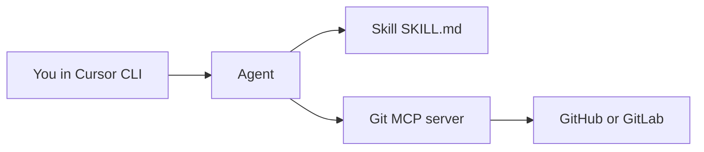

# MCP vs Skills in Cursor CLI

## Table of Contents

<!-- toc -->

- [1. Overview](#1-overview)
- [2. Create a Skill with `/create-skill`](#2-create-a-skill-with-create-skill)
- [3. Configure a Git provider MCP in your project](#3-configure-a-git-provider-mcp-in-your-project)
- [4. Workflow tips](#4-workflow-tips)
- [5. Troubleshooting](#5-troubleshooting)
- [6. Reference](#6-reference)

<!-- tocstop -->

---

## 1. Overview

Cursor agents can be extended in two complementary ways:

| Capability | What it is | What it gives the agent |
| ---------- | ---------- | ------------------------ |
| **Skill** | A markdown playbook (`SKILL.md`) | Workflow, conventions, and step-by-step instructions |
| **MCP** | A Model Context Protocol server | Typed tools and resources (API calls, live data, actions) |

**Skills teach the agent how to work.**  
**MCP gives the agent new powers.**

They work well together: a Skill can define a repeatable workflow, while a Git provider MCP performs the actual issue/MR/pipeline operations.

MCP may however use more tokens than a skill, since a MCP query is usually more verbose. Sometimes you can create a skill for a CLI tool which may be token effective than a MCP server, but may lack some functionality. Really depends on the tool and use case.

If you're interested more about the technical side of MCPs, you can read the official [documentation](https://modelcontextprotocol.io/docs/getting-started/intro). Basically it is like an API for the agent to use.



This guide focuses on first creating a skill for reviewing code based on some static rules (something that is repetitive and great for an agent to do). Then we will configure a git MCP server for querying more information about project management and merge requests.

---

## 2. Create a Skill with `/create-skill`

### What gets created

Running `/create-skill` scaffolds a skill folder with `SKILL.md` frontmatter (`name`, `description`) and starter instructions.

| Location | Path | Scope |
| -------- | ---- | ----- |
| Project | `.cursor/skills/<skill-name>/SKILL.md` | Shared with the repo |
| Personal | `~/.cursor/skills/<skill-name>/SKILL.md` | Available in all projects |

### Create a code review skill

Let's create an example skill for reviewing code style based on some static rules (taken from TalTech's general clean code rules in Estonian).

1. Open Cursor CLI (or Agent chat) in your project root.
2. Run:

   ```text
   /create-skill
   ```

3. When prompted, describe the skill. Example prompt:

   ```text
   Create a project skill for general code review:
   - flag DRY violations and duplicated logic
   - evaluate naming, function length, and readability
   - check separation of concerns and single responsibility
   - follow clean code standards from:
     https://javadoc.pages.taltech.ee/code_style/clean-code.html
   ```

4. Confirm the scaffolded path, for example:

   ```text
   .cursor/skills/code-review-basics/SKILL.md
   ```

5. Refine `SKILL.md` so it is actionable. Minimal example:

   ```markdown
   ---
   name: code-review-basics
   description: >-
     Performs general code review with focus on DRY and clean code principles.
     Use when reviewing pull requests, refactors, and new feature implementations.
   ---

   # Code Review Basics

   ## Review focus
   1. Find duplicated logic and suggest shared abstractions (DRY)
   2. Flag unclear naming and suggest clearer alternatives
   3. Point out overly long functions and mixed responsibilities
   4. Check that code is easy to read and reason about

   ## Standards
   - Use TalTech clean code guidance as baseline:
     https://javadoc.pages.taltech.ee/code_style/clean-code.html
   - Prefer concrete findings with file-level references
   - Prioritize correctness and maintainability over style-only notes
   ```

6. Validate the skill:

   ```text
   /code-review-basics
   Review the current changes and list DRY and clean-code issues first.
   ```

> [!TIP]
> If a skill does not appear in the `/` menu in CLI, keep it in `.cursor/skills/` and invoke it explicitly (`/<skill-name>`). You can also ask the agent to follow that skill by name in your prompt.

**Docs:** [Skills][skills-docs]

---

## 3. Configure a Git provider MCP in your project

This section combines **general MCP configuration** with concrete setups for **GitLab** (GitLab.com or self-hosted) and **GitHub**. It's recommended to configure it on project basis.

### 3.1 Create the project config file

Create `.cursor/mcp.json` in your project root:

```text
your-project/
├── .cursor/
│   ├── mcp.json
│   └── skills/
│       └── code-review-basics/
│           └── SKILL.md
└── ...
```

### 3.2 Config locations

| Scope | File |
| ----- | ---- |
| Project | `.cursor/mcp.json` |
| Global | `~/.cursor/mcp.json` |

Project config overrides global config for the same server name.

- [Jump to GitLab MCP setup](#34-gitlab-mcp-gitlabcom-or-self-hosted)
- [Jump to GitHub MCP setup](#36-github-mcp)

### 3.3 Keep secrets out of git (recommended setup)

Do not commit tokens in `mcp.json`. Use `envFile`:

Add `.env` to `.gitignore`, then keep provider tokens in `.env`.

GitLab `.env` example:

```bash
GITLAB_URL=https://gitlab.example.com
GITLAB_TOKEN=glpat_...
```

For GitLab.com, set `GITLAB_URL=https://gitlab.com`.

GitLab token and personal access token are available at `GITLAB_URL/-/user_settings/personal_access_tokens`. Set permissions to `api` and `read_repository`.

### 3.4 GitLab MCP (GitLab.com or self-hosted)

This guide uses `mcp-gitlab` (Python-based, run via `uvx`).

Add this to `.cursor/mcp.json`:

```json
{
  "mcpServers": {
    "gitlab": {
      "command": "uvx",
      "args": ["mcp-gitlab"],
      "envFile": "${workspaceFolder}/.env"
    }
  }
}
```

What the fields mean:

| Field | Purpose |
| ----- | ------- |
| `command` | Executable to start the MCP server (`npx`, `node`, `python`, `docker`, etc.) |
| `args` | Arguments passed to the command |
| `env` | Environment variables for the server (we're using envFile for this) |
| `envFile` | Load secrets from a file (recommended for tokens) |

If your self-hosted GitLab uses a self-signed certificate in a controlled environment, your MCP server may support a TLS override variable (check server docs, e.g. `GITLAB_SSL_VERIFY=false`).

### 3.5 Verify GitLab MCP is loaded

1. Open **Settings > Tools & MCP**.
2. Confirm your server appears and is connected (healthy/green state).
3. In Agent chat, ask:

   ```text
   Using GitLab MCP tools, list open merge requests in our main project and summarize pipeline status.
   ```

**Docs:** [MCP][mcp-docs]

---

### 3.6 GitHub MCP

This guide uses `@modelcontextprotocol/server-github` (Node-based, run via `npx`).

GitHub `.env` example:

```bash
GITHUB_PERSONAL_ACCESS_TOKEN=ghp_...
```

Create the token in GitHub settings (Developer settings > Personal access tokens) with the minimum scopes needed. For most repository workflows, start with `repo` (and `read:org` if needed).

Add this server to `.cursor/mcp.json`:

```json
{
  "mcpServers": {
    "github": {
      "command": "npx",
      "args": ["-y", "@modelcontextprotocol/server-github"],
      "envFile": "${workspaceFolder}/.env"
    }
  }
}
```

What the fields mean:

| Field | Purpose |
| ----- | ------- |
| `command` | Executable to start the MCP server (`npx`, `node`, `python`, `docker`, etc.) |
| `args` | Arguments passed to the command |
| `env` | Environment variables for the server (we're using envFile for this) |
| `envFile` | Load secrets from a file (recommended for tokens) |

> [!NOTE]
> GitHub also maintains `github/github-mcp-server`. Community packages vary by feature set; start with the example above, then switch if your team standardizes on the official server.

### 3.7 Verify GitHub MCP is loaded

1. Open **Settings > Tools & MCP**.
2. Confirm your server appears and is connected (healthy/green state).
3. In Agent chat, ask:

   ```text
   Using the GitHub MCP tools, list open pull requests for this repository and summarize their CI status.
   ```

---

## 4. Workflow tips

Now you can use these tools in your prompts to query issues, merge requests and pipelines using the git MCP server or have the agent perform a code review using a skill.

Use your new Skill + Git MCP for repeatable studio workflows:

| Workflow | Skill responsibility | MCP responsibility |
| -------- | -------------------- | ------------------ |
| Feature branch | Naming, MR template, review rules | Create/list MRs, fetch diffs, comment |
| Build validation | Define required jobs per platform | Read pipeline status and failed jobs |
| Release candidate | Changelog + approval checklist | List tags/releases, verify green pipelines |
| Hotfix | Fast-track process and owners | Create hotfix branch/MR, monitor CI |

---

## 5. Troubleshooting

| Problem | What to check |
| ------- | ------------- |
| MCP server not listed | `.cursor/mcp.json` path, JSON validity, restart Tools & MCP |
| Auth failures | Token value, scopes, expired token, wrong host URL |
| Self-hosted GitLab TLS errors | Instance URL, cert trust settings, server-specific TLS env vars |
| Skill not in `/` menu | Skill path is `.cursor/skills/<name>/SKILL.md`; invoke explicitly with `/<name>` |
| Agent ignores skill | Mention skill directly: `Follow /code-review-basics ...` |
| `npx` fails on Windows | Use Cursor docs pattern: `command: "cmd"` with `args: ["/c", "npx", ...]` |

---

## 6. Reference

### Cursor docs

- [Skills][skills-docs]
- [MCP][mcp-docs]
- [Agent security guide](4-agent-security-guide.md)
- [TalTech clean code standard][taltech-clean-code]

### Example MCP servers

- [GitHub MCP server][github-mcp-server]
- [MCP servers catalog][mcp-servers]
- [mcp-gitlab][mcp-gitlab]

<!-- Link definitions -->
[mcp-docs]: https://cursor.com/docs/mcp
[skills-docs]: https://cursor.com/docs/context/skills
[github-mcp-server]: https://github.com/github/github-mcp-server
[mcp-servers]: https://github.com/modelcontextprotocol/servers
[mcp-gitlab]: https://github.com/vish288/mcp-gitlab
[taltech-clean-code]: https://javadoc.pages.taltech.ee/code_style/clean-code.html
