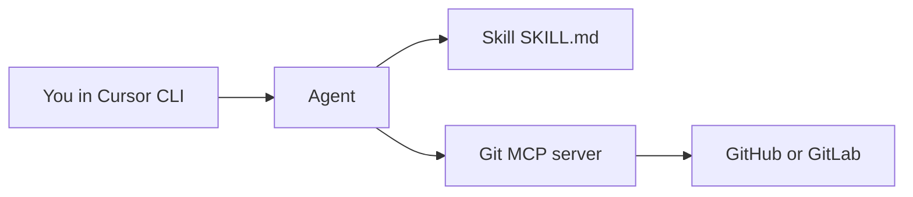

# MCP vs Skills in Cursor

## Table of Contents

<!-- toc -->

- [1. Overview](#1-overview)
- [2. Create a Skill with `/create-skill`](#2-create-a-skill-with-create-skill)
- [3. Configure a Git provider MCP in your project](#3-configure-a-git-provider-mcp-in-your-project)
- [4. Workflow tips](#4-workflow-tips)
- [5. Troubleshooting](#5-troubleshooting)
- [6. Reference](#6-reference)

<!-- tocstop -->

---

## 1. Overview

Cursor agents can be extended in two complementary ways:

| Capability | What it is | What it gives the agent |
| ---------- | ---------- | ------------------------ |
| **Skill** | A markdown playbook (`SKILL.md`) | Workflow, conventions, and step-by-step instructions |
| **MCP** | A Model Context Protocol server | Typed tools and resources (API calls, live data, actions) |

**Skills teach the agent how to work.**  
**MCP gives the agent new powers.**

They work well together: a Skill can define a repeatable workflow, while a Git provider MCP performs the actual issue/MR/pipeline operations.

MCP may however use more tokens than a skill, since a MCP query is usually more verbose. Sometimes you can create a skill for a CLI tool which may be token effective than a MCP server, but may lack some functionality specific for agents. Really depends on the tool and use case.

Like for instance we could use the Github's/Gitlab's own MCP server to access issues or we could also create a skill for using the Github CLI tool `gh` (or Gitlab's `glab`) which can also query and manage issues.

If you're interested more about the technical side of MCPs, you can read the official [documentation](https://modelcontextprotocol.io/docs/getting-started/intro). Think of it as an API for the agent to use.



This guide focuses on first creating a skill for reviewing code based on some static rules (something that is repetitive and great for an agent to do). Then we will configure a git MCP server for querying more information about project management like issues and merge requests.

---

## 2. Create a Skill with `/create-skill`

### What gets created

Running `/create-skill` scaffolds a skill folder with `SKILL.md` frontmatter (`name`, `description`) and starter instructions.

| Location | Path | Scope |
| -------- | ---- | ----- |
| Project | `.cursor/skills/<skill-name>/SKILL.md` | Shared with the repo |
| Personal | `~/.cursor/skills/<skill-name>/SKILL.md` | Available in all projects |

### Create a code review skill

Let's create an example skill for reviewing code style based on some static rules (taken from TalTech's general clean code rules in Estonian).

1. Open Cursor CLI (or Agent chat) in your project root.
2. Run:

   ```text
   /create-skill
   ```

3. When prompted, describe the skill. Example prompt:

   ```text
   Create a project skill for general code review:
   - flag DRY violations and duplicated logic
   - evaluate naming, function length, and readability
   - check separation of concerns and single responsibility
   - follow clean code standards from:
     https://javadoc.pages.taltech.ee/code_style/clean-code.html
   ```

4. Confirm the scaffolded path, for example:

   ```text
   .cursor/skills/code-review-basics/SKILL.md
   ```

5. Review and refine `SKILL.md` to your liking so it is actionable. Minimal example:

   ```markdown
   ---
   name: code-review-basics
   description: >-
     Performs general code review with focus on DRY and clean code principles.
     Use when reviewing pull requests, refactors, and new feature implementations.
   ---

   # Code Review Basics

   ## Review focus
   1. Find duplicated logic and suggest shared abstractions (DRY)
   2. Flag unclear naming and suggest clearer alternatives
   3. Point out overly long functions and mixed responsibilities
   4. Check that code is easy to read and reason about

   ## Standards
   - Use TalTech clean code guidance as baseline:
     https://javadoc.pages.taltech.ee/code_style/clean-code.html
   - Prefer concrete findings with file-level references
   - Prioritize correctness and maintainability over style-only notes
   ```

6. Try it out:

   ```text
   /code-review-basics
   Review the current changes and list DRY and clean-code issues first.
   ```

**Docs:** [Skills][skills-docs]

---

## 3. Configure a Git provider MCP in your project

This section combines **general MCP configuration** with concrete setups for **GitLab** (GitLab.com or self-hosted) and **GitHub**. 

It's recommended to configure MCPs in the project, as each project may require different MCP servers or you will have unneccessary token wasting or lookups if you don't require it in another project.

### 3.1 Create the project config file

Create `.cursor/mcp.json` in your project root:

```text
your-project/
├── .cursor/
│   ├── mcp.json
│   └── skills/
│       └── code-review-basics/
│           └── SKILL.md
└── ...
```

### 3.2 Config locations

| Scope | File |
| ----- | ---- |
| Project | `.cursor/mcp.json` |
| Global | `~/.cursor/mcp.json` |

Project config overrides global config for the same server name.

### 3.3 Keep secrets out of git

Do not commit tokens in `mcp.json`.

- **GitLab (official HTTP MCP):** uses OAuth in the browser; no PAT in `.env` required.
- **GitLab (community stdio MCP):** store a PAT in `.env` and load it with `envFile`.
- **GitHub (remote MCP):** store a PAT in your shell environment and reference it with `${env:...}` in `headers` (remote servers do not support `envFile`).

Add `.env` to `.gitignore` when you use PAT-based setups loaded from files.

- [Jump to GitLab MCP setup](#34-gitlab-mcp-gitlabcom-or-self-hosted)
- [Jump to GitHub MCP setup](#36-github-mcp)

### 3.4 GitLab MCP (GitLab.com or self-hosted)

Pick one setup path below. Both are self-contained.

Quick links inside this section:

- [Official GitLab MCP (requires Gitlab Premium/Ultimate)](#341-official-gitlab-mcp-recommended)
- [Community stdio MCP (for Gitlab Community Edition and self-hosted)](#342-community-stdio-mcp-pat-based-alternative)

#### 3.4.1 Official GitLab MCP (recommended)

GitLab ships a built-in MCP endpoint at:

`https://<your-gitlab-host>/api/v4/mcp`

Cursor connects over HTTP and authenticates with OAuth (no PAT in `mcp.json`).

Cursor has an official Gitlab plugin as well which has some additional features but for the sake of this guide, we will show how to configure it manually. The flow is similar to all other MCP servers.

**Prerequisites (from GitLab docs):**

- GitLab Premium/Ultimate (GitLab.com, Self-Managed, or Dedicated)
- GitLab Duo enabled (for self-managed)
- Beta/experimental features enabled where required by your admin

Add this to `.cursor/mcp.json`:

```json
{
  "mcpServers": {
    "GitLab": {
      "type": "http",
      "url": "https://gitlab.example.com/api/v4/mcp"
    }
  }
}
```

For GitLab.com, use `https://gitlab.com/api/v4/mcp`.

**Verify official GitLab MCP is loaded**

1. Open **Settings > Tools & MCP**.
2. Confirm `GitLab` appears and is connected.
3. Save `mcp.json` and approve OAuth in the browser when prompted (restart Cursor if the browser window does not open).
4. In Agent chat, ask:

   ```text
   Using GitLab MCP tools, list open merge requests in our main project and summarize pipeline status.
   ```

**Docs:** [GitLab MCP server][gitlab-mcp-docs], [MCP][mcp-docs]

#### 3.4.2 Community MCP server (PAT-based alternative)

If your instance does not expose the official endpoint (Gitlab Community Edition), a common community option is [`zereight/gitlab-mcp`](https://github.com/zereight/gitlab-mcp) (`@zereight/mcp-gitlab` on npm).

GitLab `.env` example:

```bash
GITLAB_PERSONAL_ACCESS_TOKEN=glpat_...
GITLAB_API_URL=https://gitlab.example.com/api/v4
```

For GitLab.com, use `GITLAB_API_URL=https://gitlab.com/api/v4`.

Create the token at `https://<your-host>/-/user_settings/personal_access_tokens` with at least `api` scope (add `read_repository` if your workflow needs it).

Add this to `.cursor/mcp.json`:

```json
{
  "mcpServers": {
    "gitlab": {
      "command": "npx",
      "args": ["-y", "@zereight/mcp-gitlab"],
      "envFile": "${workspaceFolder}/.env"
    }
  }
}
```

What the fields mean:

| Field | Purpose |
| ----- | ------- |
| `command` | Executable to start the MCP server (`npx`, `node`, `python`, `docker`, etc.) |
| `args` | Arguments passed to the command |
| `env` | Environment variables for the server (we're using envFile for this) |
| `envFile` | Load secrets from a file (recommended for tokens) |

**Verify community GitLab MCP is loaded**

1. Open **Settings > Tools & MCP**.
2. Confirm `gitlab` appears and is connected.
3. In Agent chat, ask:

   ```text
   Using GitLab MCP tools, list open merge requests in our main project and summarize pipeline status.
   ```

---

### 3.6 GitHub MCP

**Prerequisites**

- Cursor v0.48.0+ (Streamable HTTP support)
- [GitHub Personal Access Token](https://github.com/settings/tokens) with minimum scopes needed (`repo`, and `read:org` if required)

Set the token in your environment (do not commit it in `mcp.json`):

```bash
export GITHUB_PERSONAL_ACCESS_TOKEN=ghp_...
```

Add this server to `.cursor/mcp.json`:

```json
{
  "mcpServers": {
    "github": {
      "url": "https://api.githubcopilot.com/mcp/",
      "headers": {
        "Authorization": "Bearer ${env:GITHUB_PERSONAL_ACCESS_TOKEN}"
      }
    }
  }
}
```

What the fields mean:

| Field | Purpose |
| ----- | ------- |
| `url` | Remote MCP endpoint (HTTP / Streamable HTTP) |
| `headers` | Auth and other request headers (use `${env:...}` for secrets) |

> [!NOTE]
> GitHub's remote server currently expects a PAT in headers (not OAuth). Cursor remote MCP entries also do not support `envFile`; use `${env:...}` instead.

### 3.7 Verify GitHub MCP is loaded

1. Restart Cursor after saving `mcp.json`.
2. Open **Settings > Tools & MCP**.
3. Confirm `github` appears and is connected (healthy/green state).
4. In Agent chat, ask:

   ```text
   Using the GitHub MCP tools, list open pull requests for this repository and summarize their CI status.
   ```

**Docs:** [Install GitHub MCP in Cursor][github-mcp-cursor-install]

---

## 4. Workflow tips

Now you can use these tools in your prompts to query issues, merge requests and pipelines using the git MCP server or have the agent perform a code review using a skill.

Use your new Skill + Git MCP for repeatable studio workflows:

| Workflow | Skill responsibility | MCP responsibility |
| -------- | -------------------- | ------------------ |
| Feature branch | Naming, MR template, review rules | Create/list MRs, fetch diffs, comment |
| Build validation | Define required jobs per platform | Read pipeline status and failed jobs |
| Release candidate | Changelog + approval checklist | List tags/releases, verify green pipelines |
| Hotfix | Fast-track process and owners | Create hotfix branch/MR, monitor CI |

Also try to make a skill for using the git provider's CLI tools like `gh` or `glab` and see which one is the better fit for your project.

---

## 5. Troubleshooting

| Problem | What to check |
| ------- | ------------- |
| MCP server not listed | `.cursor/mcp.json` path, JSON validity, restart Tools & MCP |
| Auth failures | Token value, scopes, expired token, wrong host URL |
| GitLab `/api/v4/mcp` returns 404 | Official MCP may be disabled on your tier/instance; use community stdio option or ask your GitLab admin |
| Self-hosted GitLab TLS errors | Instance URL, cert trust settings, server-specific TLS env vars |
| GitHub MCP fails to connect | Cursor v0.48.0+, `GITHUB_PERSONAL_ACCESS_TOKEN` exported in shell, PAT scopes valid |
| GitHub Streamable HTTP errors | Update Cursor, verify URL is `https://api.githubcopilot.com/mcp/`, check proxy/firewall |
| Skill not in `/` menu | Skill path is `.cursor/skills/<name>/SKILL.md`; invoke explicitly with `/<name>` |
| Agent ignores skill | Mention skill directly: `Follow /code-review-basics ...` |
| `npx` fails on Windows | Use Cursor docs pattern: `command: "cmd"` with `args: ["/c", "npx", ...]` |

---

## 6. Reference

### Cursor docs

- [Skills][skills-docs]
- [MCP][mcp-docs]
- [Agent security guide](4-agent-security-guide.md)
- [TalTech clean code standard][taltech-clean-code]

### Example MCP servers

- [GitHub MCP server (official)][github-mcp-server]
- [Install GitHub MCP in Cursor][github-mcp-cursor-install]
- [GitLab MCP server (official)][gitlab-mcp-docs]
- [zereight/gitlab-mcp (community stdio)][zereight-gitlab-mcp]
- [MCP servers catalog][mcp-servers]

<!-- Link definitions -->
[mcp-docs]: https://cursor.com/docs/mcp
[skills-docs]: https://cursor.com/docs/context/skills
[github-mcp-server]: https://github.com/github/github-mcp-server
[github-mcp-cursor-install]: https://github.com/github/github-mcp-server/blob/main/docs/installation-guides/install-cursor.md
[gitlab-mcp-docs]: https://docs.gitlab.com/user/gitlab_duo/model_context_protocol/mcp_server/
[zereight-gitlab-mcp]: https://github.com/zereight/gitlab-mcp
[mcp-servers]: https://github.com/modelcontextprotocol/servers
[taltech-clean-code]: https://javadoc.pages.taltech.ee/code_style/clean-code.html
