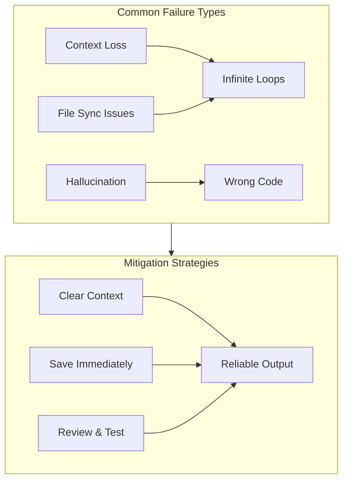

# Understanding agent mistakes

## Table of Contents

<!-- toc -->

- [1. Overview](#1-overview)
- [2. Context management issues](#2-context-management-issues)
- [3. File synchronization problems](#3-file-synchronization-problems)
- [4. Code quality issues](#4-code-quality-issues)
- [5. Workflow best practices](#5-workflow-best-practices)
- [6. Troubleshooting](#6-troubleshooting)
- [7. Reference](#7-reference)

<!-- tocstop -->

---

## 1. Overview

AI coding agents accelerate development but introduce new failure modes. Understanding these patterns transforms you from a passive user into an effective **Agent Orchestrator**, someone who guides, validates, and corrects AI outputs strategically.



### Key principle

Treat AI-generated code as **tentative suggestions from a capable but fallible assistant**. The agent excels at speed and pattern recognition but lacks judgment and self-verification. Your role is to provide the oversight it cannot provide itself.

---

## 2. Context management issues

Context management is the most common source of agent failures. The agent operates within a limited context window. When this fills up or becomes cluttered, performance degrades significantly.

### 2.1 Context loss and infinite loops

**Problem:** The agent loses track of its progress within a task, repeatedly searching for the same information or applying the same fix.

**Symptoms:**
- Repetitive output like "Let me search for..." followed by the same search
- Agent re-asks questions you already answered
- Same code changes applied multiple times

**Solutions:**

| Action | How to do it |
| ------ | ------------ |
| Start fresh | Open a new chat session to reset context |
| Break down tasks | Divide complex work into smaller, focused requests |
| Monitor token usage | Watch for signs of context saturation |
| Clear chat history | Use `Settings > Clear All Chats` periodically |

> [!TIP]
> If the agent enters a loop, don't try to fix it within the same session. Start a new chat with a clearer, more focused prompt.

### 2.2 Hallucination and irrelevant suggestions

**Problem:** The agent generates plausible-looking but incorrect code, referencing non-existent functions, using wrong APIs, or ignoring your actual codebase structure.

**Symptoms:**
- Code references functions or variables that don't exist
- Suggestions that ignore runtime errors or logs you provided
- Generic solutions that don't fit your specific framework or architecture

**Solutions:**

- **Provide explicit context:** Use `@file` or `@folder` to point the agent to relevant code
- **Include error messages:** Paste actual error output rather than describing it
- **Specify constraints:** Mention your framework, versions, and architectural patterns

```text
# Bad prompt
"Fix the authentication bug"

# Good prompt
@file:src/auth/login.ts
"The login function throws 'TypeError: Cannot read property email of undefined'
when the user object is null. Add null checking before accessing user.email."
```

### 2.3 Lost in the middle

**Problem:** When context becomes very long, agents tend to focus on information at the beginning and end, "forgetting" details in the middle.

**Solutions:**

- Keep critical information near the start or end of your prompt
- For long tasks, summarize key constraints at the end
- Reference important files directly rather than relying on earlier mentions

---

## 3. File synchronization problems

### 3.1 Unsaved changes causing loops

**Problem:** The agent applies code changes that register in the editor buffer but aren't immediately written to disk. When the agent re-reads the file, it sees the old content and attempts the same edit again.

**Symptoms:**
- Same edit applied repeatedly
- Unsaved file indicator (dot) persists after AI edits
- Agent "fixes" the same issue multiple times

**Solutions:**

| Action | How to do it |
| ------ | ------------ |
| Enable autosave | See [Setup fundamentals > Enable autosave][setup-fundamentals] |
| Manual save | Press `Cmd+S` / `Ctrl+S` after each AI edit |
| Watch indicators | Check for unsaved dots before allowing agent to continue |

> [!WARNING]
> If you notice the agent applying the same change repeatedly, **stop immediately**. Save the file manually, then verify the change was applied before continuing.

### 3.2 Version control as safety net

Always commit working code before starting significant AI-assisted changes. This provides instant rollback capability.

For git undo commands (`git reset`, `git restore`), see [Setup fundamentals > Undo commands][setup-fundamentals].

> [!TIP]
> Commit after each successful AI-assisted change. Small, frequent commits make it easy to identify exactly where things went wrong.

---

## 4. Code quality issues

### 4.1 The "junior developer" pattern

AI agents can behave like inexperienced developers, producing code that works superficially but contains subtle logic errors, missing edge cases, or architectural problems.

**Common issues:**
- Removing essential null checks or error handling
- Breaking existing functionality while adding new features
- Ignoring project conventions and patterns
- Adding redundant or conflicting dependencies

**Solutions:**

- **Request incremental changes:** Ask for small, focused modifications rather than large rewrites
- **Specify what to preserve:** Explicitly mention code that should not be changed
- **Review diffs carefully:** Check every change before accepting, not just the new code

```text
# Risky prompt
"Refactor the user service to use async/await"

# Safer prompt
"In @file:src/services/userService.ts, convert the fetchUser function
(lines 45-60) to use async/await. Keep all existing error handling
and don't modify other functions."
```

### 4.2 Enforcing validation with tests

LLMs cannot self-verify their logic. Compensate by having the agent write tests alongside implementation.

**Approach:**

1. Ask the agent to write tests first (TDD style)
2. Then implement the feature
3. Run tests to validate

```text
"Using TDD, implement a validateEmail function:
1. First write tests for: valid emails, invalid formats, empty input, null input
2. Then implement the function to pass all tests"
```

> [!NOTE]
> Tests written by AI also need review, but they provide an additional layer of validation and documentation for expected behavior.

---

## 5. Workflow best practices

### 5.1 The orchestrator mindset

Shift from "coder who uses AI" to "orchestrator who directs AI":

| Old approach | Orchestrator approach |
| ------------ | -------------------- |
| Accept suggestions blindly | Review every change critically |
| Fix AI mistakes in same session | Rollback and re-prompt with better context |
| One big request | Multiple small, focused requests |
| Hope it works | Verify with tests and manual review |

### 5.2 Effective prompting strategies

**Structure your prompts:**

1. **Context:** What file/function you're working with
2. **Goal:** What you want to achieve
3. **Constraints:** What should not change, frameworks to use, patterns to follow
4. **Success criteria:** How you'll know it's correct

**Example structured prompt:**

```text
Context: @file:src/components/UserProfile.tsx

Goal: Add loading state while fetching user data

Constraints:
- Use existing LoadingSpinner component from @file:src/components/ui/LoadingSpinner.tsx
- Keep current error handling
- Follow existing patterns in the codebase

Success criteria:
- Show spinner during API call
- Hide spinner when data loads or error occurs
- No layout shift when transitioning states
```

### 5.3 When to stop and restart

Recognize when a session has gone off track:

- Agent is looping or repeating itself
- Suggestions have become increasingly irrelevant
- You've corrected the same mistake multiple times
- Context feels "polluted" with failed attempts

**Recovery steps:**

1. Stop the current session
2. Commit or stash any good changes
3. Rollback problematic changes: `git restore .`
4. Start a fresh chat with lessons learned incorporated into the prompt

### 5.4 Use Plan Mode for complex tasks

For multi-step or architectural changes, use Plan Mode (`Cmd+P` / `Ctrl+P`) to:

- Force the agent to research before implementing
- Review the approach before code is written
- Catch misunderstandings early

> [!TIP]
> Plan Mode is especially valuable when you're unsure about the best approach. Let the agent propose a plan, refine it together, then execute.

---

## 6. Troubleshooting

| Problem | Likely cause | Solution |
| ------- | ------------ | -------- |
| Agent repeats same action | Context loss or file sync issue | Start new session, save files manually |
| Suggestions ignore my code | Insufficient context provided | Use `@file` to reference specific files |
| Code references non-existent functions | Hallucination | Provide more explicit constraints and examples |
| Agent removes important code | Unclear about what to preserve | Specify what should NOT change |
| Performance is slow | Large context or heavy codebase | Reduce context, use `.cursorignore` |
| Same "fix" applied repeatedly | Unsaved changes | Enable autosave or save manually after each edit |
| Agent gets stuck on first prompt | Loop bug | Restart Cursor, report to community forum |

---

## 7. Reference

For Cursor settings, context symbols, and chat modes, see [Setup fundamentals][setup-fundamentals].

### Documentation

- [Cursor Documentation][cursor-docs]
- [Cursor Rules][cursor-rules]
- [Agent Security][cursor-security]
- [Cursor Forum][cursor-forum]

<!-- Link definitions -->
[setup-fundamentals]: 1-setup-fundamentals.md
[cursor-docs]: https://cursor.com/docs
[cursor-rules]: https://cursor.com/docs/rules
[cursor-security]: https://cursor.com/docs/agent/security
[cursor-forum]: https://forum.cursor.com
